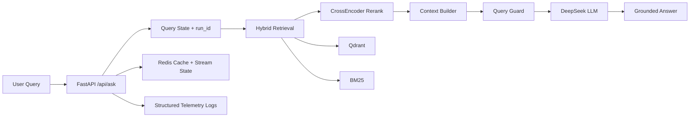
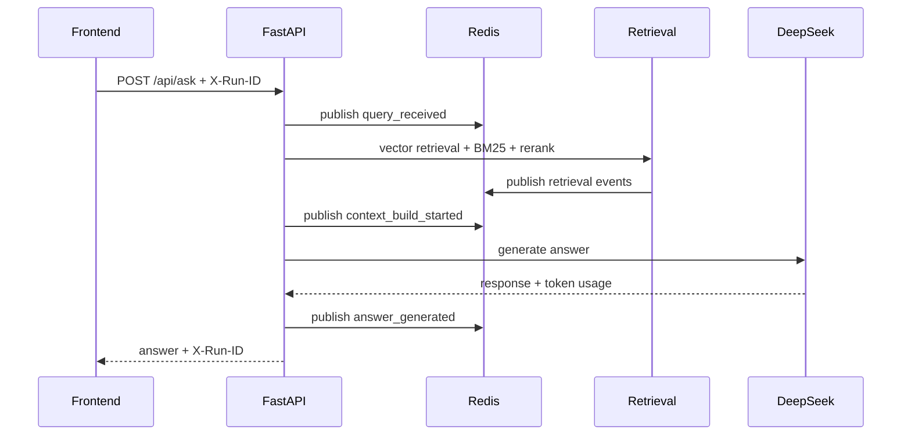
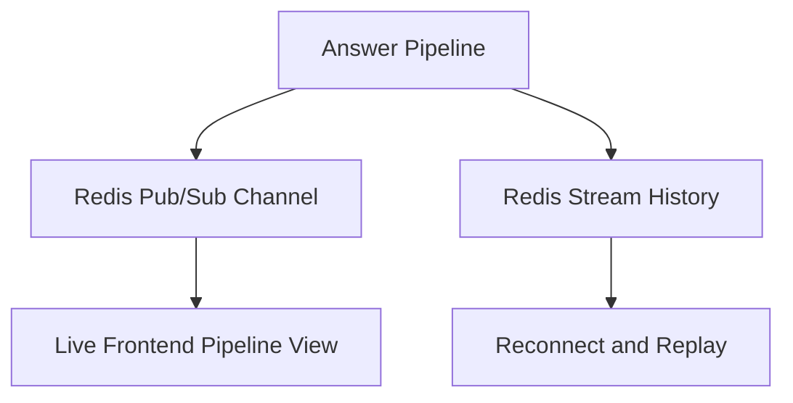

# Hybrid RAG SEC AI


Hybrid RAG SEC AI is a production-style Retrieval-Augmented Generation system for question answering over SEC filings.

It combines FastAPI, LangGraph orchestration, multi-layer caching, hybrid retrieval (Qdrant + BM25), CrossEncoder reranking, and DeepSeek LLM inference into a production-oriented RAG pipeline.

## Architecture

```text
User Query
   ↓
FastAPI
   ↓
LangGraph Orchestrator
   ↓
Cache Layer
   ├─ Exact Answer Cache
   ├─ Semantic Cache
   └─ Retrieval Cache
   ↓
Hybrid Retrieval
   ├─ Qdrant Vector Search
   └─ BM25 Lexical Search
   ↓
CrossEncoder Reranker
   ↓
Context Builder
   ↓
DeepSeek LLM
   ↓
Answer + Sources
```

## Highlights

- Production-style FastAPI API
- LangGraph orchestration
- Qdrant vector retrieval
- BM25 lexical retrieval
- Hybrid retrieval merge
- CrossEncoder reranking
- Exact answer cache
- Semantic cache
- Retrieval cache
- Synthetic evaluation dataset generation
- RAGAS evaluation pipeline
- Warm-up runtime tooling
- Load testing support

## Performance

Verified local results:

- Load test: 1000 requests
- Average latency: ~2.0 s
- Error rate: ~1.1%
- Hit@k: ~0.91
- Faithfulness: ~0.87
- Answer relevancy: ~0.84
- Warm cache latency: ~100 ms

## API Example

### Request

`POST /api/ask`

```json
{
  "query": "What legal risks did Apple mention in its 10-K filings?",
  "company": "Apple Inc.",
  "form": "10-K"
}
```

### Response

```json
{
  "query": "What legal risks did Apple mention in its 10-K filings?",
  "answer": "...",
  "mode": "llm",
  "sources": "Sources:\n- Apple Inc. | 10-K | ...",
  "cache_hit": false
}
```

## Project Goal

The system is built to answer questions over SEC filings such that responses:

- come from real filing chunks
- include traceable sources
- respect company/form scope
- can be measured through retrieval evaluation and RAGAS

Example queries:

- `What legal risks did Apple mention in its 10-K filings?`
- `What did NVIDIA disclose in its annual report?`
- `What governance topics did Apple discuss in its proxy statement?`

## Dataset Snapshot

Current verified local snapshot:

- Companies: 10,425
- Filing HTML documents: 360
- Parsed documents: 360
- Indexed chunks: 13,424
- Embedding model: `all-MiniLM-L6-v2`
- Active vector backend: `Qdrant`

Indexed companies include:

- Apple Inc.
- NVIDIA CORP
- Alphabet Inc.

Indexed filing types include:

- 10-K
- 10-Q
- 8-K
- DEF 14A
- DEFA14A
- SC 13G
- SC 13G/A

## Project Structure

```text
hybrid-rag/
├─ app/
│  ├─ main.py
│  ├─ core/
│  ├─ services/
│  ├─ retrieval/
│  ├─ llm/
│  ├─ router/
│  ├─ pipeline/
│  ├─ ingestion/
│  └─ graph/
├─ data/
├─ tests/
├─ docker-compose.yml
├─ requirements.txt
└─ README.md
```

Important runtime modules:

- `app/services/answer_service.py`
- `app/services/semantic_cache.py`
- `app/retrieval/resources.py`
- `app/retrieval/retrieval_cache.py`
- `app/retrieval/qdrant_store.py`
- `app/retrieval/bm25_retriever.py`
- `app/retrieval/reranker.py`
- `app/llm/langchain_chain.py`

## Runtime Flow

The active runtime behind `/api/ask` works as follows:

1. FastAPI receives the query, optionally with `company` and `form`.
2. LangGraph prepares runtime state.
3. Exact answer cache lookup runs first.
4. Semantic cache lookup runs next.
5. Retrieval cache lookup runs next.
6. On cache miss, the system performs:
   - Qdrant vector retrieval
   - BM25 lexical retrieval
   - hybrid merge
   - CrossEncoder rerank
   - metadata filtering
   - deduplication
   - context limiting
7. Context is built from the final retrieval rows.
8. DeepSeek generates the answer.
9. Semantic cache and exact cache are updated when safe.

## Observability & Traceability

The runtime includes a full observability layer for the RAG pipeline.
Each request is assigned a unique `run_id` that makes it possible to trace execution from query ingestion to final answer generation.

Every major step emits structured telemetry logs, which makes it easier to debug retrieval quality, latency, cache behavior, and hallucination sources without changing the API contract.

### End-to-End Request Trace

Each query gets a unique identifier:

```text
run_id
```

This identifier propagates through the full request path:

```text
query_received
embedding_created
hybrid_retrieval_started
reranking_started
context_build_started
llm_generation_started
answer_generated
```

All related events share the same `run_id`, which allows reconstructing the complete execution timeline across the API layer, retrieval layer, and LLM layer.

Example telemetry log:

```json
{
  "event": "llm_call",
  "run_id": "6bf7c6f2c912457eb73713799620d292",
  "model": "deepseek-chat",
  "prompt_tokens": 4372,
  "completion_tokens": 363,
  "total_tokens": 4735,
  "latency_ms": 15053,
  "retrieved_documents": [
    "64220091cc9230bbeff1a1ca",
    "bcb62ddf66548c51775997e9"
  ]
}
```

This telemetry allows operators to analyze:

- which documents influenced the answer
- retrieval latency vs LLM latency
- token usage and estimated cost
- cache effectiveness
- likely hallucination sources

### Monitoring / Observability Mindset

This project is built with a production observability mindset rather than a demo mindset.

That means the runtime is designed so operators can answer questions such as:

- Which documents actually influenced this answer?
- Was the response served from cache or from the full pipeline?
- Did reranking suppress a relevant chunk?
- Was the answer slow because of retrieval or because of the LLM?
- Did a query fail because of retrieval quality, guardrails, or model inference?

In practice, this means the system already includes:

- structured JSON-compatible logs
- request-level `run_id` tracing
- retrieval and reranking telemetry
- LLM latency and token tracking
- Redis-backed live pipeline event streaming
- Redis-backed stream persistence for replay
- cache hit/miss tracing

### Observability Diagrams

#### Production RAG Runtime



#### Request Trace by `run_id`



#### Streaming and Replay



Live stream key:

```text
pipeline_stream:{run_id}
```

Replay history key:

```text
pipeline_run:{run_id}
```

### Pipeline Event Streaming

The system supports real-time pipeline event streaming through Redis.

Each live request publishes to:

```text
pipeline_stream:{run_id}
```

Events are also persisted for replay under:

```text
pipeline_run:{run_id}
```

This enables:

- live frontend progress updates
- debugging long-running queries
- replay after reconnect
- isolation between simultaneous requests, even for identical query text

Example pipeline events:

```text
query_received
embedding_created
hybrid_retrieval_started
reranking_started
context_build_started
llm_generation_started
answer_generated
```

### LLM Telemetry

The LLM layer logs detailed telemetry for every model call.

Captured fields include:

```text
run_id
query
model
prompt_tokens
completion_tokens
total_tokens
prompt_length
response_length
latency_ms
retrieved_documents
error
```

This enables monitoring of:

- token usage
- inference latency
- prompt size
- model cost
- retrieval influence on the final answer

If token metadata is unavailable, the system falls back to:

```text
prompt_length
response_length
```

### Retrieval Observability

The retrieval layer logs candidate documents and ranking behavior.

Logged fields include:

```text
query
top_k
retrieved_document_ids
rerank_scores
final_scores
latency_ms
```

Example:

```json
{
  "event": "retrieval_result",
  "run_id": "6bf7c6f2c912457eb73713799620d292",
  "query": "What legal risks did Apple mention in its 10-K filings?",
  "top_k": 10,
  "retrieved_document_ids": [
    "64220091cc9230bbeff1a1ca",
    "bcb62ddf66548c51775997e9"
  ],
  "rerank_scores": [1.51, 1.95],
  "final_scores": [1.33, 1.32],
  "latency_ms": 6406
}
```

This makes it possible to analyze:

- retrieval quality
- reranker behavior
- context construction decisions
- why specific chunks influenced the answer

### LLM Guardrails

Before the model is called, the pipeline applies validation and routing guards to keep inference grounded and cost-aware.

Guardrails include:

```text
query routing checks
company/form filter validation
token-overlap validation for semantic cache
retrieval relevance validation
query guard before LLM generation
```

If a query fails validation, the system can:

- route to a fallback answer
- skip unnecessary LLM calls
- return a guarded response for out-of-domain prompts

This reduces hallucinations and prevents wasted inference cost.

### Distributed Concurrency Control

The runtime supports multi-worker deployment.

Concurrency-sensitive state is coordinated through Redis, including:

- exact answer cache
- retrieval cache
- semantic cache
- pipeline event streaming
- distributed LLM concurrency limiting
- BM25 invalidation signaling

This avoids:

- worker-local cache corruption
- stream mixing between requests
- uncontrolled parallel LLM calls
- stale worker-local retrieval state

### Production Observability Features

The current runtime provides:

```text
structured JSON telemetry logs
run_id request tracing
Redis-based pipeline event streaming
Redis stream persistence and replay
LLM token usage tracking
retrieval and reranking telemetry
latency measurements
cache hit monitoring
Qdrant bootstrap logging
```

These features make the system behave like a production-style RAG backend with end-to-end pipeline transparency.

### Debugging a Query

To debug a request:

1. locate the `run_id`
2. inspect logs for that `run_id`
3. inspect retrieval candidates and rerank scores
4. inspect context construction
5. inspect `llm_call`
6. inspect `response_generated`

Typical debugging path:

```text
run_id
 -> retrieval_result
 -> context_built
 -> llm_call
 -> response_generated
```

This makes it possible to determine whether issues originate from:

- retrieval
- reranking
- context construction
- LLM inference
- cache reuse

### Result

With these observability components, the system provides:

```text
full RAG pipeline transparency
LLM telemetry and cost tracking
retrieval debugging capabilities
real-time pipeline monitoring
production-grade traceability
```

## Retrieval Layer

The active production vector backend is Qdrant with:

- cosine similarity
- persistent storage
- HNSW indexing
- payload metadata filters

The payload includes fields such as:

- `company`
- `company_norm`
- `form`
- `form_norm`
- `filing_date`
- `accession_number`
- `filing_url`
- `source_file`
- `html_title`
- `chunk_index`
- `chunk_text`
- `chunk_hash`
- `vector_id`

BM25 remains the lexical side of the hybrid retriever.

The reranker model is:

- `cross-encoder/ms-marco-MiniLM-L-6-v2`

## Cache Architecture

The system uses three cache layers.

### 1. Exact Answer Cache

Storage:

- Redis

Stores:

- final answer
- mode
- sources
- timestamps
- LLM metadata

TTL:

- LLM answer: 24 hours
- fallback: 10 minutes

### 2. Retrieval Cache

Storage:

- Redis

Stores:

- final retrieval rows after merge, rerank, metadata filtering, deduplication, and limit

TTL:

- 24 hours

### 3. Semantic Cache

Storage:

- Redis

Stores:

- final answer
- final sources

Does not store:

- raw retrieval rows

TTL:

- 7 days

Safety rules:

- disabled if effective `company_filter` is missing
- disabled if effective `form_filter` is missing
- isolated by `index_version`, `company`, `form`, and `query_type`
- cosine similarity lookup
- token overlap safety guard

Current guards:

- similarity threshold: `0.82`
- top1/top2 margin: `0.015`
- token overlap ratio: `0.5`

## Environment Variables

Required:

```env
DEEPSEEK_API_KEY=your_key
```

Minimal `.env`:

```env
DEEPSEEK_API_KEY=your_key
LLM_MODEL=deepseek-chat
LLM_API_URL=https://api.deepseek.com/chat/completions
```

Optional:

```env
RAGAS_EMBEDDING_MODEL=all-MiniLM-L6-v2
RAGAS_MAX_TOKENS=8192
REDIS_URL=redis://localhost:6379/0
QDRANT_URL=http://localhost:6333
QDRANT_COLLECTION_ALIAS=sec_filings_chunks_current
```

## Running the System

### Docker

```bash
docker compose build
docker compose up -d
```

Endpoints:

- API: `http://localhost:8021`
- Swagger: `http://localhost:8021/docs`
- Qdrant: `http://localhost:6333`

### Local Python

```powershell
python -m venv .venv
.venv\Scripts\activate
pip install -r requirements.txt
uvicorn app.main:app --host 0.0.0.0 --port 8021
```

## Offline Pipeline

Typical order:

```powershell
python app/ingestion/sec_ingest.py
python app/pipeline/data_cleaner.py
python app/pipeline/download_filing_html.py
python app/pipeline/parse_filing_html.py
python app/pipeline/chunk_filings.py
python app/pipeline/build_qdrant_index.py
```

## Evaluation Suite

Available scripts:

- `tests/run_eval.py`
- `tests/run_rag_eval.py`
- `tests/run_ragas_eval.py`
- `tests/run_retrieval_cache_eval.py`
- `tests/run_semantic_cache_eval.py`
- `tests/run_synthetic_dataset_check.py`
- `tests/run_warmup_validation.py`

Measured metrics include:

- latency
- retrieval quality
- faithfulness
- answer relevancy
- cache behavior

## Debugging Workflow

If something breaks:

1. check `.env`, especially `DEEPSEEK_API_KEY`
2. check `docker compose ps`
3. verify `data/vectorstore/runtime_manifest.json`
4. verify the Qdrant collection exists
5. run `python app/pipeline/answer_with_llm.py "..."`
6. run retrieval cache and semantic cache tests
7. inspect warm-up reports
8. inspect structured logs by `run_id`

## Summary

Hybrid RAG SEC AI is a modular production-style SEC filing QA system built with FastAPI, LangGraph, Qdrant + BM25 hybrid retrieval, multi-layer caching, DeepSeek LLM inference, and a complete evaluation pipeline.
